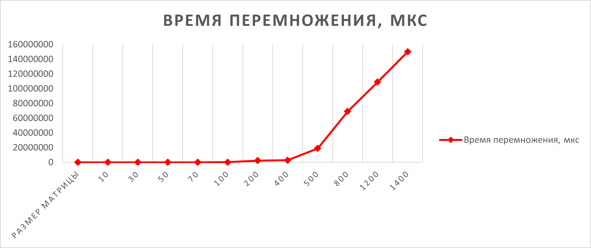

# parallel-programming
Отчёт
Результаты исследований :
Перемножение матриц
10*10 матрицы - 57 микросекунд
30*30 матрицы - 1011 микросекунд
50*50 матрицы - 4607 микросекунд
70*70 матрицы - 15253 микросекунд
100*100 матрицы - 47983 микросекунд
200*200 матрицы - 279994 микросекунд
400*400 матрицы - 2432654 микросекунд
500*500 матрицы - 2907542 микросекунд
800*800 матрицы - 18935796 микросекунд
1200*1200 матрицы - 69073565 микросекунд
1400*1400 матрицы - 109075492 микросекунд
2000*2000 матрицы - 150070430 микросекунд

Таблица результатов :

| Размер матрицы | Время умножения (мкс) |
|----------------|----------------------:|
| 10             | 57                    |
| 30             | 1011                  |
| 50             | 4607                  |
| 70             | 15253                 |
| 100            | 47983                 |
| 200            | 279994                |
| 400            | 2432654               |
| 800            | 18935796              |
| 1200           | 69073565              |
| 1400           | 109075492             |
| 2000           | 150070430             |

график :

Файлы с матрицами находятся в папке matrix

В ходе выполнения лабораторной работы была разработана программа на языке C++ для умножения квадратных матриц. Программа реализует класс Matr для работы с матрицами, загрузку исходных данных из текстовых файлов и сохранение результата. Корректность вычислений проверялась с помощью скрипта на Python с использованием библиотеки NumPy — результаты полностью совпали с эталонными в пределах заданной точности. Также был проведён анализ времени выполнения умножения для матриц различных размеров. Все поставленные задачи выполнены в полном объёме.

