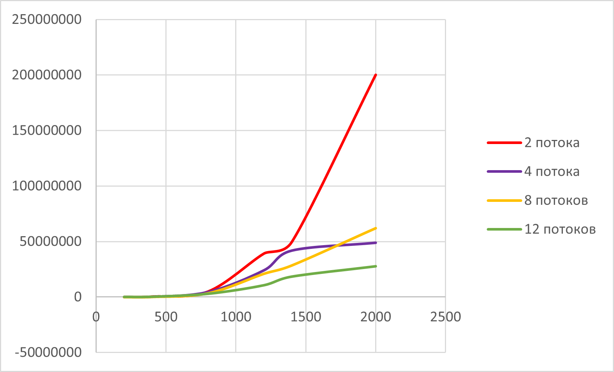

# parallel-programming
Отчёт
Результаты исследований:
Перемножение матриц
200*200 матрицы 
2 потока - 74272 микросекунд 
4 потока - 39129 микросекунд 
8 потока - 30223 микросекунд 
12 потока - 29100 микросекунд 

400*400 матрицы
2 потока - 494538 микросекунд 
4 потока - 314036 микросекунд 
8 потока - 220986 микросекунд 
12 потока - 179000 микросекунд

800*800 матрицы
2 потока - 5017926 микросекунд 
4 потока - 4566015 микросекунд 
8 потока - 3479983 микросекунд 
12 потока - 2852477 микросекунд

1200*1200 матрицы 
2 потока - 39239525 микросекунд 
4 потока - 24115233 микросекунд 
8 потока - 20999342 микросекунд 
12 потока - 10616659 микросекунд

1400*1400 матрицы
2 потока - 4976592 микросекунд 
4 потока - 41884823 микросекунд 
8 потока - 28502399 микросекунд 
12 потока - 18451591 микросекунд

2000*2000 матрицы
2 потока - 200193858 микросекунд 
4 потока - 48914481 микросекунд 
8 потока - 61884282 микросекунд 
12 потока - 27832027 микросекунд
Таблица результатов

## Matrix Multiplication Time (microseconds)

| Matrix Size | 2 threads  | 4 threads | 8 threads | 12 threads |
|-------------|------------|-----------|-----------|------------|
| 200 × 200   | 74,272     | 39,129    | 30,223    | 29,100     |
| 400 × 400   | 494,538    | 314,036   | 220,986   | 179,000    |
| 800 × 800   | 5,017,926  | 4,566,015 | 3,479,983 | 2,852,477  |
| 1200 × 1200 | 39,239,525 | 24,115,233| 20,999,342| 10,616,659 |
| 1400 × 1400 | 49,765,192 | 41,884,823| 28,502,399| 18,451,591 |
| 2000 × 2000 | 200,193,858| 48,914,481| 61,884,282| 27,832,027|

График:

Варианты всех матриц содержаться внутри проекта
Вывод:
Написав программу на языке С++ для перемножения двух матриц(что включало написания класса матриц с представлением через строку чисел с типом данных double, а также разбиение класса на стандартный список объявления и определения + функция main с демонстрацией всего выше перечисленного) также мы добавили вариативность в области выбора количества потоков для выполнения операции умножения. Мы провели эксперимент по замеру времени процесса умножения двух матриц меняя количество потоков, а также сравнили результаты с аналогичным процессом, написанным на Python с использованием встроенных библиотек. Результат оказался вполне приятным, так как финальные файлы совпали по содержимому. Столкнулся единственный раз с проблемой неудовлетворительного чтения файла, который был создан в результате программы, во время верификации и сравнения результатов. Но сие программное беззаконие устранил и получил рабочую систему. В результате мы получили совпадение по результату умножения матриц и время, за которое оно было осуществлено. 

