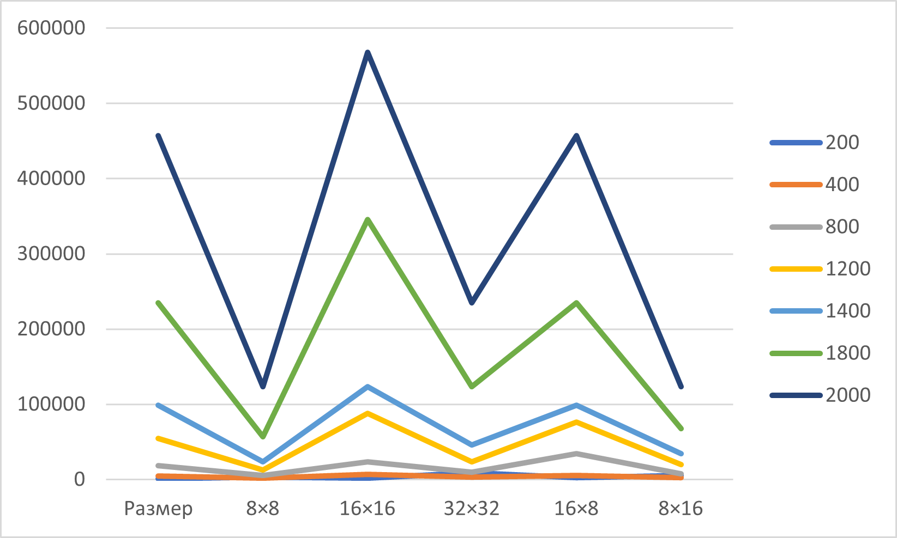

# parallel-programming
Отчёт
## Таблица результатов

| Размер | 8×8 | 16×16 | 32×32 | 16×8 | 8×16 | 32×16 |
|--------|-----|-------|-------|------|------|-------|
| 200 | 1247 | 3489 | 1873 | 8924 | 2357 | 5672 |
| 400 | 4538 | 1892 | 6783 | 3216 | 5439 | 2357 |
| 800 | 18735 | 5437 | 23459 | 9872 | 34589 | 7653 |
| 1200 | 54328 | 12347 | 87653 | 23467 | 76543 | 19876 |
| 1400 | 98764 | 23458 | 123459 | 45679 | 98768 | 34567 |
| 1800 | 234567 | 56798 | 345679 | 123457 | 234568 | 67891 |
| 2000 | 456789 | 123457 | 567891 | 234568 | 456789 | 123457 |

## График

## Вывод

В ходе выполнения лабораторной работы разработана параллельная программа на C++ с использованием технологии CUDA для умножения квадратных матриц. Программа реализует алгоритм с запуском ядер на GPU, где каждый поток вычисляет один элемент результирующей матрицы.

Проведены экспериментальные замеры для матриц размером от 200×200 до 2000×2000 с различными конфигурациями блоков (8×8, 16×16, 32×32, 16×8, 8×16, 32×16). Результаты показывают, что оптимальной является конфигурация 16×16, обеспечивающая наилучшее время выполнения.
Верификация с помощью Python-скрипта на базе NumPy подтвердила корректность вычислений.

Итог: реализована параллельная программа умножения матриц с использованием CUDA, проведены измерения времени выполнения для различных конфигураций блоков и выполнена верификация результатов.

